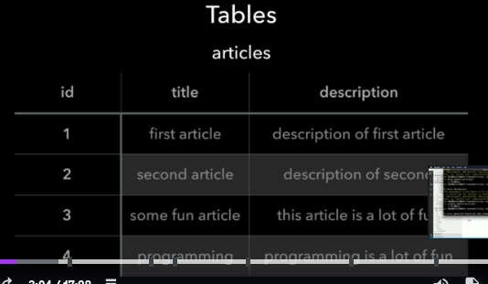
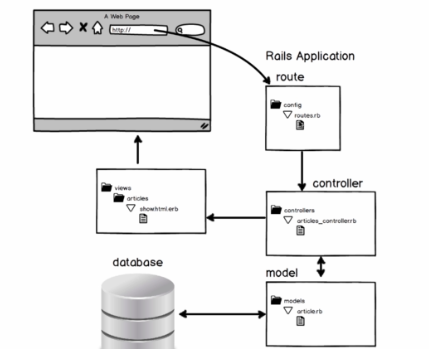
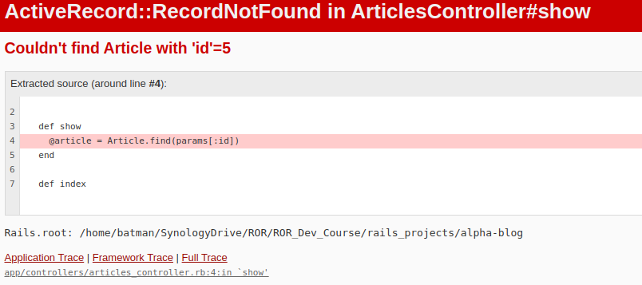

# CRUD and scaffold generators - Text directions, references and code
Query language to communicate with database: SQL (Structured Query Language)

CRUD actions:

C - Create

R - Read

U - Update

D - Delete

## One line Scaffold Generation in Rails
Scaffold generator command to create an article model (with two attributes), articles controller, views for articles and migration file to create articles table:

rails generate scaffold Article title:string description:text

Command to see routes presented in a viewer-friendly way:

rails routes --expanded

The line resources :articles in the config/routes.rb file provides the following routes:

- index of articles (GET request)

- new article (GET)

- create article (POST)

- edit article (GET)

- update article (PUT and PATCH)

- show article (GET)

- delete article (DELETE)

From UI perspective ->

- index lists all the articles in the articles table in the database of the app

- new article deals with the form to enter in new article details

- create handles the submission of the items in the new article form

- edit article deals with the form to enter edited information for an existing article

- update article deals with the submission of the edit article form

- show article displays an individual article based on selection

- delete article deletes an article from the articles table

In preparation for the next section, learn and practice SQL here: https://www.w3schools.com/sql/
# Chpt 76 Introduction to Section 4: Tables, migrations and naming conventions
## This Section of the Complete ROR Dev Course Looks at Manually Creating all the Functionality that the one line Scaffold Generator Creates

Rails naming conventions - Articles resources
- model
- Table
- controller
- views
## Resource: Articles
The resource will have an articles model, articles table, articles controller, and also views that allow us to perform all the CRUD actions from the front end. Let's start by looking at the Model and Table.
### Rails naming conventions - Articles resource
- Model name: article (Rails will define an article (singular))
- Article model file name: article.rb
- Article model class name: Article
- Table name: articles (Rails will maintain articles (plural))
We will start by building the table.



1. The id column will be automatically generated by Rails. It will be the primary key of this table.
2. title property will be string (255 character limit)
3. description property will be text (as provides for more text than string)

To generate a table we need a migration file. In your project directory create a migration file called "create_articles"
```
rails generate migration create_articles
```
We use the generator to create migration files as Rails automatically appends a time stamp (see the string of numbers in the filename). This becomes important as we create or append migration files.

Rails creates the table (as one doesn't exist), and we need to add the title attributes. For now we just put in the article title attribute (we'll do details later).
```ruby
  t.string :title
```  
I noted that my Rails already had:
```ruby
  t.timestamps
```
Whereas Mushrur's video did not show this. I presume this is because I'm using a later version of Rails.

Now we will run this migration file. Note that Rails only runs migration files that have never run before.
```
rails db:migrate
```
You can see the newly minted table in the db folder, schema.rb

Rails only runs the migrate command on files that have never been migrated. If there are no new migrate files then nothing will happen.

If you want to update or append an existing table you have to rollback the previous migration, and run rails migrate again. Of course it is not the preferred way to create a database table.

To rollback (or undo) the last migration, do:
```
rails db:rollback
```
You can then go to the last migration creation file and update it to what you wanted.
```ruby
class CreateArticles < ActiveRecord::Migration[7.0]
  def change
    create_table :articles do |t|
      t.timestamps
      t.string :title
      t.text :description
    end
  end
end
```
The schema file will now have the updated attributes.

However, as mentioned, rollback is not the preferred method to deal with amending a table.

E.g. When coding in a team, if you used rollback on your version and then uploaded the code changes, another team member couldn't run the same migration file as it would already have run. So the code bases will be different.

### Database Amendment - Preferred method of amendment
Create a new migration file to reflect any changes to the database. That way, in a team a team member will see there is a new migration file.

E.g. A new migration file:
```
rails generate migration add_author_to_articles #note that Mashrur had add timestamps here instead of author, but the latest Rails automatically adds timestamps, so there is no need to do that.
```
The syntax for adding to an existing table is:
```ruby
  add_column :[name of table], :[title of attribute], :[datatype]
```
So my change showed:
```ruby
class AddAuthorToArticles < ActiveRecord::Migration[7.0]
  def change
    add_column :articles, :author, :string
  end
end
```
Now that we have our table, we'll need our model (or articles model) to work with this table.
# Notes from Chpt 77
## Details

Model name: article

Class name: Article -> Capitalized A and singular, CamelCase

File name: article.rb -> singular and all lowercase, snake_case

Table name: articles -> plural of model name and all lowercase

Additional example:

Model name: user

Class name: User -> Capitalized U and singular, CamelCase

File name: user.rb -> singular and all lowercase, snake_case

Table name: users -> plural of model name

Generate a migration to create a table (in this example articles):

rails generate migration create_articles

To add attributes for the table in the migration file, add the following inside create_table block:
```
t.string :title
```
To run the migration file, run the following command from the terminal:
```
rails db:migrate
```
The first time you run the migration file, it will create the database, the articles table and a schema.rb file.

To rollback or undo the changes made by the last migration file that was run, you may use the following command:
```
rails db:rollback
```
If you have run the rollback step, then you can update the previous migration file and add the following line to add a description attribute (column) to the articles table:

    t.text :description

To run the newly edited migration file again, you can run
```
rails db:migrate
```
Note: This above line will only work if you had rolled back the prior migration.

To generate a new migration file to add or make changes to your articles table you can generate a new file:
```
rails generate migration name_of_migration_file
```
Then within the def change method in the migration file you can add the following lines:

    add_column :articles, :created_at, :datetime
    add_column :articles, :updated_at, :datetime

You can run the newly created migrations file by running rails db:migrate from the command line and check out the schema.rb file to check that the changes were reflected properly.
# chpt 78 Models and rails console
First we create article.rb in the App > Model folder. Every model we make will be based on the ApplicationRecord < ActiveRecord base. In the article.rb file we write:
```ruby
class Article < ApplicationRecord

end
```
That is all that's needed in order to communicate with the database. This gives us Getters and Setters to interact with the articles in the database, through the Rails Console (IRB).

We can access the console by typing ```rails console``` or ```rails c``` in our terminal.

To see all our articles in the database we type the Class then all:
```ruby
Article.all
```
## Create
To create table entries directly, we:
```ruby
Article.create(title: "first article", description: "description of first article", author: "Draco Satiric")
```
A preferred way of doing it in the console is through using variables.
E.g.
```ruby
article = Article.new
```
Then it is easy to ascribe properties:
```ruby
article.title = "second article"
article.description = "description of second article"
article.author = "Blazmer Mahmoud"
```
However, up to this point the object is not saved in the database. It is only in the console. If you look you'll see that the id, created at, and updated at, fields are all "nil"
```ruby
irb(main):009:0> article
=>
#<Article:0x00007f0e3b6925f8                                                    
 id: nil,                                                                       
 created_at: nil,                                                               
 updated_at: nil,                                                               
 title: "second article",                                                       
 description: "description of second article",                                  
 author: "Blazmer Mahmoud">                                                     
irb(main):010:0>
```
The way to "hit" the article database table is:
```ruby
article.save
```
A third way to enter an object into the database is to put the properties all on one line:
```ruby
article = Article.new(title: "third article", description: "description of third article", author: "Shysna Pzycq")
```
Now there will be 3 articles in the articles table.
## Chpt 80 Read, Update, Delete
To search for a specific object in the table if you know the id:
```ruby
Article.find(2) #where 2 is the object id
```
If you wish to change something about an object then it is better to create a variable linked to an article object.
E.g.
```ruby
article = Article(2)
```
### Getters
Now when I call article I will get the 2nd article. If I just wanted to see the title of the second article then I can use the variable as a Getter, i.e.
```ruby
article.title
article.description
article.author
```
### Setters
How about using Setters? What if we wanted to update the description of the 2nd article?
```ruby
article.description = "edited - description of second article"
```
However, this has not hit the database table. As you can see if you type in:
```ruby
Article.find(2)
=>
#<Article:0x00007f0f296f1a28                                                    
 id: 2,                                                            
 created_at: Tue, 24 May 2022 06:42:46.650887000 UTC +00:00,       
 updated_at: Tue, 24 May 2022 06:42:46.650887000 UTC +00:00,       
 title: "second article",                                          
 description: "description of second article",                     
 author: "Blazmer Mahmoud">  
 ```
To reflect the change in the database table we must save it:
```ruby
article.save
```
### Delete
How do we delete an object in the database table? Let's do it with the last article in the table.
```ruby
article = Article.last
```
We delete the article by using "destroy",
```ruby
article.destroy
```
Now, note that this hits the database immediately. There is no need to save.
```ruby
irb(main):014:0> article.destroy
  TRANSACTION (0.2ms)  begin transaction
  Article Destroy (1.3ms)  DELETE FROM "articles" WHERE "articles"."id" = ?  [["id", 3]]                                                           
  TRANSACTION (103.1ms)  commit transaction                        
=>                                                                 
#<Article:0x00007f0f2972acb0                                       
 id: 3,                                                            
 created_at: Tue, 24 May 2022 07:14:31.993903000 UTC +00:00,       
 updated_at: Tue, 24 May 2022 07:14:31.993903000 UTC +00:00,       
 title: "third article",                                           
 description: "description of third article",                      
 author: "Shysna Pzycq">                                           
```
### Note
If we look at the model (app>models>article.rb) there are no restrictions to what can be created. We could create one with no title and no description and it will still hit the table. We don't want this as it ruins the integrity of the table. We want to put in restraints to what can be added. That is, add validations.

### Chpt Summary
To find an article by id you can use the find method like below:
```ruby
Article.find(1) # replace 1 with id of article you want to find
```
You can save this to a variable and use it like below
```ruby
    article = Article.find(1)
    article.title # to display (get) the title
    article.description # to display (get) the description
```
You can use the methods below to view the first and last articles of the articles table:
```ruby
    Article.first # display the first article in the articles table
    Article.last # display the last article in the articles table
```
You can update an article by finding it first and then using setters for the attributes that the model provides like below:
```ruby
    article = Article.find(id of article you want to edit)
    article.title = "new title"
    article.description = "new description"
    article.save
```
You can delete an article by using the destroy method. A sample sequence could be like below:
```ruby
    article = Article.find(id of article you want to delete)
    article.destroy
```
## Chpt 82 Validations
First, we wish to ensure that an object in the table (an article) can only be added if it has a title. We update the article.rb file:
```ruby
class Article < ApplicationRecord
  validates :title, presence: true
end
```
This change won't take effect until we reload the Rails Console. This can be done by exiting and restarting, or by:
```ruby
reload!
```
Now if an object with no title has a save attempt, it will result in the flag "false", of which details can be seen with:
```ruby
article.errors
```
And to see the full details of an error:
```ruby
article.errors.full_messages
```
### Validation further
Currently the validation would allow useless information such as just "a" or "b". This would corrupt our data within the table. We need to enforce minimum lengths for these properties.

We do that by adjusting the validates :title line in the article.rb file:
```ruby
validates :title, presence: true, length: ( minimum: 6, maximum: 100 )
```
I noted that the validation is not retroactive, that is, the validations do not effect existing table entries.
## Chpt 84 Show articles (route, action and view)


For this lesson it is important to remember that the items covered here can be automatically generated in Rails. We are hand coding it to help our understanding.

So, showing an individual article the request goes to the routes.rb file where it will get the 'show' route, and then to the controller to get the 'show' action. Then the show action interacts with the database with the help of the model, and then send the information back to the controller who'll send it to the 'show' view.

### Config routes.rb

So first step is to create the show route in the config>routes.rb file.
Adding:
```ruby
resources :articles
````
will give all the routes we need to access the articles. In the terminal you can see all the routes expanded with:
```
rails routes --expanded
```  
For the lesson Mushrur just wants to focus on the 'show' action, and so changed the routes.rb file as:
```ruby
resources :articles, only: [:show]
```
### Config controller
Add new file "resources" for the new routing; new filename will be articles_controller.rb
```ruby
class ArticlesController < ApplicationController

end
```
It is easy to hand code, and follows the same format as the PagesController. If you try to go to localhost:3000/articles/1 then you'll now get the error that the action 'show' is missing. So now we build that in the controller we just created:
```ruby
class ArticlesController < ApplicationController
  def show

  end
end
```
First, there is no 'aricles' folder under views. So we need to add that folder first. Second, we add the show.html.erb page.

Now, that show.html.erb page is currently just static. We want to pull the appropriate article and show the details on this page. We do that by fleshing out the 'show' action in the ArticlesController.

The id of the article (which is the last part of the url) is passed in via the params hash: params (short for parameters), it's a hash data structure. The way we enter that is:
```ruby
params[:id]
```
However, if we def show as:
```ruby
def show
  article = Article.find(params[:id])
end
```
it won't work as the variable "article" is not carried to the pages view. To do that, we need to create an instanced variable.
### Create instanced variable
to create an instanced variable we just add '@' in front, i.e. @article.
```ruby
class ArticlesController < ApplicationController

  def show
    @article = Article.find(params[:id])
  end

end
```
Now that it is an instanced variable it is available in the 'show' view.
### Display instanced variable
To use Ruby code within the show html file we need to use embedded ruby tags.
```html
<p><strong>Title: <%= @article.title %> </strong></p>
<p><strong>Description: <%= @article.description %></strong></p>
```
Note, that without the '=' within the embedded ruby tag, the code would just be evaluated, it would not show. You need the '=' to show it.

We can run a debugger which is built in to Rails (gem = debug) by putting:
```ruby
class ArticlesController < ApplicationController

  def show
    debugger
    @article = Article.find(params[:id])
  end

end
```
Then when refreshing a webpage you can go step by step in the rails server terminal.

During the debugging you can type 'params' to see what parameters are being taken, and to can also be specific e.g. params[:id] will return the id of the article of the currently called page.

To get out of the debugging console type 'continue'.
## Chpt 85 Show articles feature - text references and code

You can find all the code added for the show feature for our articles resource here: https://github.com/udemyrailscourse/alpha-blog-6/commit/7304bca894202f78535b4abdc870d42f6a254967

Show actions are usually used to display individual items in a resource. For example:

- a specific article from an articles table

- a specific user's profile from a social media app

- details of a specific stock from a stocks table

- a specific recipe from a list of recipes

The steps are to -

1) Have a route for it

2) Have the corresponding controller/action that the route directs the request to

3) Have a corresponding view to display to the user who makes the request

The code details for each step are in the link provided at the beginning of this text resource. As a reminder: the red highlighted area are removals and the green highlighted area are additions.

## Chpt 86 Articles Index
Objective is to have the webpage home/articles, with a listing of all the articles available to view.

Request comes for a list of articles, it goes via routing to our listing controller (an index action). From this action we'll use the Article model which will interact with the database and grab a listing of all the article titles with an instance variable, and make it available to our index action in the controller. Then use a view and iterate through each article and list their title in the view. 
### build the route
Looking at
```
rails routes --expanded
```
We see that url for index is /articles and the controller#action is articles#index.

So in routes.rb we add :index to the resources line:
```ruby
  resources :articles, only: [:show, :index]
```
Then we need to add an index action to our articles_controller:

```ruby
  def index
  end
```
And then because we have an index action, we need to add an index view under views>articles> index.html.erb

Now we can see our Index page when we navigate to home/articles.

Now we need to add some code to our ArticlesController#index action such that we can list all our articles on the home/articles page.

We go back to our index action in the ArticlesController and:

```ruby
  def index 
    @articles = Article.all
  end
```
Then we go back to our index.html.erb and:

```html
<h1>Articles Index</h1>

<table>
  <thead>
    <tr>
      <th>Title</th>
      <th>Description</th>
      <th>Actions</th>
    </tr>
  </thead>


  <tbody>
    <% @articles.each do |article| %>
      <tr>
        <td><%= article.title %></td>
        <td><%= article.description %></td>
        <td>Placeholder</td>
      </tr>
    <% end %>
  </tbody>

</table>
```
## Chpt 88 Forms - Building New Article Creation Form
When we click on the create article form it will submitting a POST request, not a GET request.

Rails also builds an authentication token to ensure that the form is being submitted from our app and not from a malicious source.

"New" action will enable us to have the form, and "CREATE" action will work behind the scenes (so we won't need a view). So we need to have the "new" and "create" routes.

In our routes.rb file we amend it thus:
```ruby
  resources :articles, only: [:show, :index, :new, :create]
```
when we
```
rails routes --expanded
```
We can see the actions required for new and create, being articles#new and articles#create. so we need to build them in our ArticlesController.

Rails provides "form helpers" to ease the creation of forms https://guides.rubyonrails.org/form_helpers.html

form_with is good but note that it uses Ajax. We will modify it so it uses an HTML post request.

### Building the Form
There are several different ways to do the form, in this case we will start with the scope, which for us is "article", and then we specify the url where the form will be sent 'articles_path'. Then to post the form using standard http post instead of ajax. 

```html
<h1>Create A New Article</h1>

<%= form_with scope: :article, url: articles_path, local: true do |f| %>

  <p>
    <%= f.label :title %></br>
    <%= f.text_field :title %>
  </p>

  <p>
    <%= f.label :description %></br>
    <%= f.text_area :description %> 
  </p>

  <p>
    <%= f.submit %>

  </p>

<% end %>
```
Now the form is shown and you can interact with the submit button, but nothing is happening. We need to update the create action in the ArticlesController:

```ruby
  def create
    render plain: params[:article]
  end 
```
## Chpt 90 Create Action - Save newly created articles
Here we will change the create action from rendering the article in the screen, to saving the article in the database table. 

We need to pass in the params to the database and can't simply use the :article tag as it isn't whitelisted to use. We need to allow the top level key "article" and the keys underneath that of "title" and "description".

```ruby
  def create
    @article = Article.new(params.require(:article).permit(:title, :description))
  end 
```
### Adjustment from Text & Video
I could not save the article to the database following the instructions above. I then realized it was because in my version I had added an "author" field, and this field was required for any entry to the table to be valid. So I updated the applicable sections in the ArticleController, the form fields (in new.html.erb) and in the index and show views to include the 'Author' field.

### What happens after the creation?
It would be logically to go to the newly created articles 'show' page. 

We add the path within the controller:
```ruby
  def create
    @article = Article.new(params.require(:article).permit(:title, :description, :author))
    @article.save  
    redirect_to article_path(@article)
  end 
```
To get this redirect path, we look again at the rails routes --expanded, and the section for showing the new article. It shows that the path is "article", hence we put 'article_path', and we also need the :id, which is provided by putting (@article).

However, because this type of redirect is so commonly used, we can simply condense it to:
```ruby
redirect_to @article
```
## Chpt 92 Messaging - Validation and Flash Messages
We change the articles controller action under create to an if statement, such that if it doesn't save, then it renders a new form. We want the validation errors to show on this newly rendered form - and we put the code for that in the new.html.erb

```html
<h1>Create A New Article</h1>

<% if @article.errors.any? %>
  <h2>Article Could Not Be Saved</h2>
  <ul>
    <% @article.errors.full_messages.each do |msg| %>
      <li><% msg %></li>
  <% end %>
  </ul>
<% end %>

<%= form_with scope: :article, url: articles_path, local: true do |f| %>
```
However, the very first time we load this page we'll get an error as we don't have a @article defined. So we need to amend the 'new' method in the controller:
```ruby
  def new
    @article = Article.new
  end 
```
After I made the changes the error message didn't come up when I saved the form with all fields blank. After looking at the questions that had come up in the course, I found that this occurred for many people. It was solved with either:
```ruby
render :new, status: :unprocessable_entity
```
In the articles_controller.rb file, or with:
```html
<%= form_with scope: :article, url: articles_path, local: true do |f| %>
```
In the new.html.erb file.

However, then the bullet points were coming up (the black dots) but no text. After searches and comparisons with the work of others I realized I had simply missed an "="! I had <% msg %> instead of <%= msg %>.
### Using Flash to Show the Article has been Saved to the Database
Rails has a helpful "Flash Message". We add this to the create action in the article_controller.rb file. There are two common types of flash messages - notice & alert. Alert being when something goes wrong.
```ruby
    if @article.save  
      flash[:notice] = "Article was successfully created."
      redirect_to @article
```
This creates a flash key, and we need to then decide where to show the key (i.e. have the message show on the screen).

We put it in the application.html.erb file (under app>views>layouts), in the body tag, right above the yield. We use a key-value pair (can call it anything you like):
```html
  <body>
    <% flash.each do |name, msg| %>
      <%= msg %>
    <% end %>
    <%= yield %>
  </body>
``` 
## Chpt 94 Edit and Update Existing Articles
First, add the update and edit routes to routes.rb
```ruby
Rails.application.routes.draw do
  root 'pages#home'
  get 'about', to: 'pages#about'
  resources :articles, only: [:show, :index, :new, :create, :edit, :update]
end
```
Then we add an edit and an update method to our articles_controller.rb file.

Then add an edit.html.erb file under views>articles. Use the information from the "new" html file as a base, and adjust the form field (as we will be using an instance of the article variable as the model).

If we run the edit file we'll get a "NoMethodError in Articles#edit", as to properly display the edit form we need to instantiate the article being edited. Next step is to define this method in the controller. We can just copy the same code we used for the "show" action:
```ruby
  def edit
    @article = Article.find(params[:id])
  end
```
Now the article details appear in the edit form. The next step is to define the "update" action in the controller so that the updated article can be saved to the database table.

```ruby
 def update
    @article = Article.find(params[:id])
    if @article.update(params.require(:article).permit(:title, :description, :author))
      flash[:notice] = "Article was successfully updated."
      redirect_to @article 
    else
      render 'edit'
    end 
  end 
```
## Chpt 96 Delete Article
First we need to add destroy to our routes.rb file
```ruby
resources :articles, only: [:show, :index, :new, :create, :edit, :update]
```
However, adding destroy will result in all the default routes being in place, so we can delete the 'only' tag and be left with the default routes setting:
```ruby
resources :articles
```
by doing this we also expose all the restful routes for our articles resources. 

REST - Representational state transfer - mapping HTTP verbs (get, post, put/patch, delete) to CRUD actions. 

Resources provides REST-ful routes to Rails resources. Mapping all the front-end routes needed to handle requests coming in, and mapping them to applications. 

As per Rails routes, the URI is /articles/:id, and the Controller#action is articles#destroy.

The controller action is:
```ruby
  def destroy
    @article = Article.find(params[:id])
    @article.destroy 
    redirect_to articles_path 
  end 
```
However, we now need to consider how we get to the destroy option. We need to add a link in the "Action" column of our articles index. 
### Embedded Ruby html linking
The code template to use is: <%= link_to '[text to show]', '[path]' %>

So the code for the link in our index file for the specific article is:
```html
<td><%= link_to 'Delete', article_path(article) %></td>
```
Then, since this is the same path for "show", we need to indicate the method we want is delete, by:
```html 
<td><%= link_to 'Delete', article_path(article), method: :delete %></td>
```
By the way, the default method is 'show', so if you want that action you do not need to specify the method.

### Edit Article Link
Looking at the rails routes --expanded entry for editing an article, the prefix is 'edit_article'. Therefore the correct entry for the edit link in the index.html.erb file is:
```ruby
        <td><%= link_to 'Edit', edit_article_path(article) %></td>
```
## Chpt 98 User Interface - Layout Links
Changed the table column 'Action' to span the 3 columns with Show, Edit and Delete.
```html
<th colspan="3">Actions</th>
```
### Link on Articles Listing Page to Create a new Article
```html
<%= link_to 'Create New Article', new_article_path %>
```
Links on Individual Article Page:
```html
<%= link_to 'Edit', edit_article_path(@article) %> |
<%= link_to 'Delete', article_path(@article), method: :delete %> |
<%= link_to 'Return to Articles Listing', articles_path %>
```
### Add "confirmation action" when deleting
We add a confirmation by using some javascript: data: { confirm: "Are you sure?" }
```html
<%= link_to 'Delete', article_path(@article), method: :delete, data: { confirm: "Are you sure?" } %> 
```
So, the link to delete didn't work for either the articles page or the show page. When clicking delete it would just show the article. Looking on the ROR website questions, this issue has come up for several people. I implemented this and it worked from the articles page to delete, but not the show page:
```html
<td><%= link_to 'Delete', article_path(article), method: :delete, data: { "turbo-method": :delete, "turbo-confirm": "Are you sure?" } %></td>
```
When I try this on the 'show' page with:
```html
<%= link_to 'Delete', article_path(@article), method: :delete, data: { "turbo-method": :delete, "turbo-confirm": "Are you sure?" } %> 
```
(note that this page uses @article instead of article), and when I try to delete the article I get the confirmation message (do I really want to delete it) and on clicking Yes I get the error: 


For some reason the pathway is following the "show" action instead of the "delete" action when running from the 'show' page.

I ensured Yarn was updated (as someone said this helped them), but no luck.

Then I found another person who had the same issue and asked the question about how to solve it. They did by adding "status: :see other' to the delete method in the controller as follows:
```ruby
  def destroy
    @article = Article.find(params[:id])
    @article.destroy 
    redirect_to articles_path, status: :see_other
  end 
```


